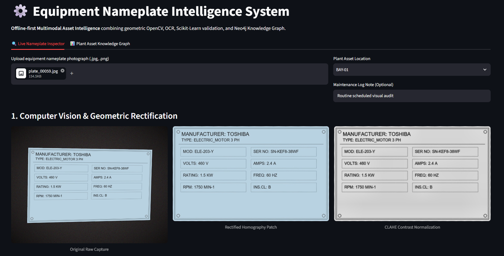
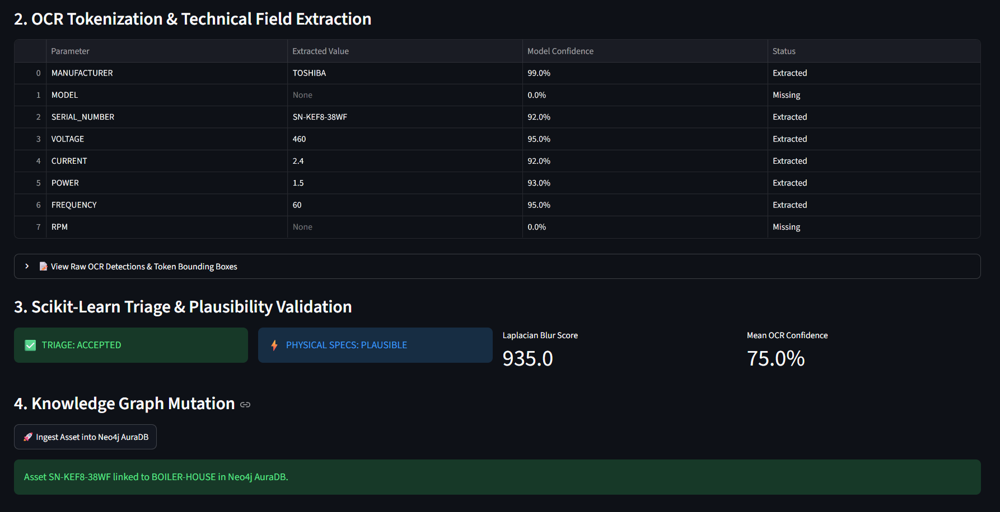
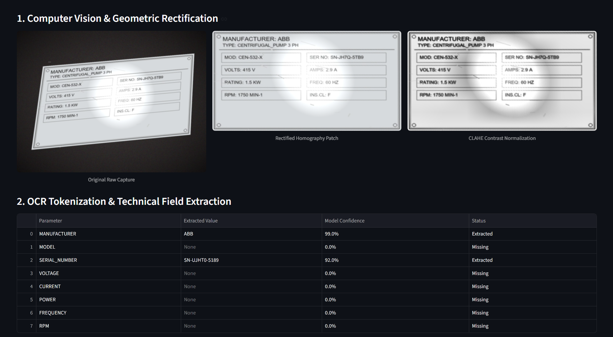
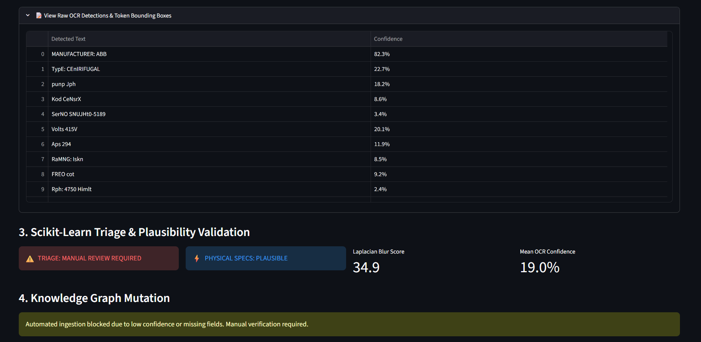
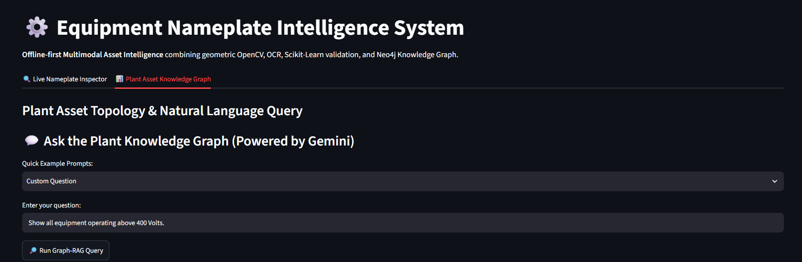
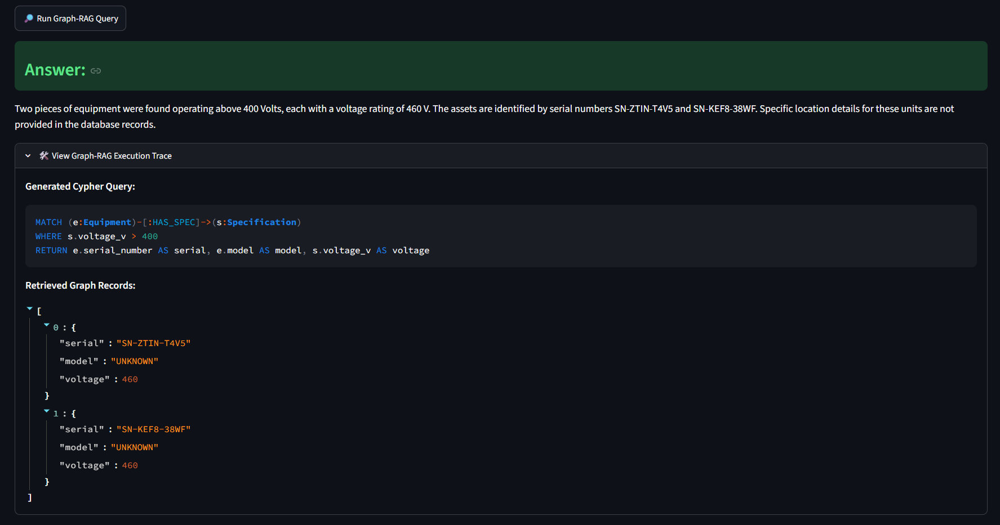
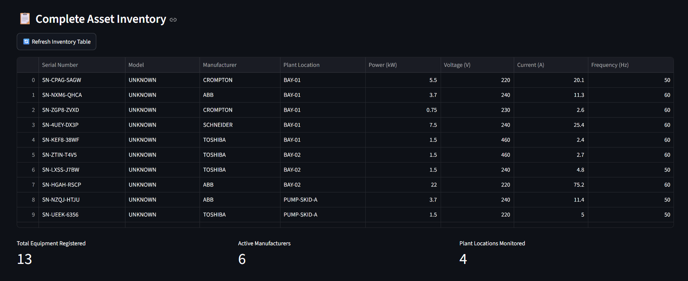

# ⚙️ Equipment Nameplate Intelligence System

An **offline-first multimodal asset intelligence system** designed for industrial facilities. The platform converts raw, skewed, and glare-affected photographs of equipment nameplates into verified engineering specifications, guards database integrity via machine learning quality gates, and connects assets into a queryable **Neo4j Knowledge Graph** with natural language **Graph-RAG** capabilities.

## 📌 Problem Statement

Industrial facilities (chemical refineries, water utilities, manufacturing plants) rely on thousands of physical assets such as electric motors, centrifugal pumps, and compressors. Every unit features an etched or stamped metal nameplate containing critical electrical and mechanical operational ratings.

Technicians and maintenance engineers routinely face three structural bottlenecks:

1. **Manual Entry Errors:** Technicians manually record serial numbers, frame sizes, and voltage ratings, leading to transcription mistakes that cause misordered replacement parts and extended downtime.
2. **Harsh Physical Environments:** Metallic nameplates suffer from severe specular reflections, perspective tilt, scratches, dirt, and uneven warehouse lighting—causing standard consumer OCR models to fail.
3. **Data Silos:** Relational databases isolate asset records. Maintenance engineers cannot easily perform topological multi-hop reasoning (e.g., _"Which pump in Sector 4 shares an interchangeable motor frame size with this failed unit?"_).

**Equipment Nameplate Intelligence** automates this entire lifecycle: capturing, un-warping, extracting, validating against physical electrical laws, and storing records in an enterprise Knowledge Graph.

---

## 🏗️ System Architecture

```text
       ┌────────────────────────┐
       │ Raw Mobile/Camera Feed │
       └───────────┬────────────┘
                   │
                   ▼
       ┌────────────────────────┐
       │  OpenCV Preprocessing  │ ──► Laplacian Blur Check (Quality Gate)
       │                        │ ──► Bilateral Edge Smoothing & Contour Finding
       │                        │ ──► 4-Point Homography (Perspective Un-warp)
       │                        │ ──► CLAHE Illumination & Contrast Normalization
       └───────────┬────────────┘
                   │ Rectified 2D Patch
                   ▼
       ┌────────────────────────┐
       │   EasyOCR Tokenizer    │ ──► CRAFT Text Detector + CRNN Character Decoder
       └───────────┬────────────┘
                   │ Tokens, Bounding Boxes, Confidence Scores
                   ▼
       ┌────────────────────────┐
       │ Industrial Regex & NLP │ ──► Token-Anchored Field Extraction & Decimal Recovery
       └───────────┬────────────┘
                   │ Extracted Specs + Quality Features
                   ▼
       ┌────────────────────────┐
       │ Scikit-Learn ML Guard  │ ──► IsolationForest (Physical Electrical Triplet Plausibility)
       │                        │ ──► RandomForest (Triage: Accepted vs. Review Required)
       └───────────┬────────────┘
                   │
         ┌─────────┴─────────┐
         ▼                   ▼
   [Flagged: 1]        [Accepted: 0]
 Manual Review Queue         │
                             ▼
                 ┌───────────────────────┐
                 │ Neo4j AuraDB (Cloud)  │ ──► Multi-hop Asset Topology
                 └───────────┬───────────┘
                             │
                             ▼
                 ┌─────────────────────────┐
                 │ Gemini Graph-RAG Engine │ ──► Text-to-Cypher + Grounded Operational Q&A
                 └─────────────────────────┘
```

## Functionalities:-

1. CLICKED RAW IMAGE PROCESSING:-

   The ingestion, computer vision inspection, and quality verification for the uploaded image of equipment namespace happens.

   # Displays three parallel visual outputs side-by-side:

   Original Raw Capture: The unedited photograph showing background clutter, camera angle tilt, and reflections.

   Rectified Homography Patch: The isolated nameplate, cropped and flattened into an upright 2D rectangle.

   CLAHE Contrast Normalization: A high-contrast, black-and-white/grayscale image optimized for reading.

   # OCR Tokenization, Technical Field Extraction:

   Computes variance of the Laplacian to reject out-of-focus captures prior to OCR processing, Locates physical plate contours and applies a perspective warp to project skewed, angled shots onto a normalized 2D plane, Utilizes CLAHE (Contrast Limited Adaptive Histogram Equalization) with localized grid limits to eliminate non-uniform reflections caused by overhead lighting.

   

2. Domain-Aware Industrial NLP Parser, Machine Learning Quality Gate and Knowledge Graph Ingestion Trigger:-

   > Performed Token-Anchored Proximity Matching, OCR Decimal Restoration and Letter/Digit Disambiguation.

   > RandomForestClassifier (Triage Gate) for ACCEPTED (auto-ingest) or MANUAL_REVIEW_REQUIRED.

   > For "ACCEPTED" scenario, directly creating the knowldege base for it in(Neo4j aura), by providing option of ingetion.

   

   > IsolationForest (Physical Plausibility Gate): The parameter triplet $[V, I, P]$ is evaluated by isolation_forest.joblib. The model uses random tree isolation splits to check if the relationship aligns with the electrical power law.

   

   > Because of blur, glare and other external factors. Not all techincal details retrieved with high confidence. So even a singe data could very important in industry set up so involving the human in the loop for verification in very important. Flagging it as "MANUAL REVIEW REQUIRED" and no ingestion process for such case.

   

3. Knowledge Graph operations(Showing knowledge base and Quering it using RAG):-

   > Query on the products that exists in knowledge base by creating the Cypher Query using "gemini-3.6-flash" llm.

   
   

   > Also showing all the details of product processed, manufacturer exists and total plant monitored.

   

### THANKYOU
